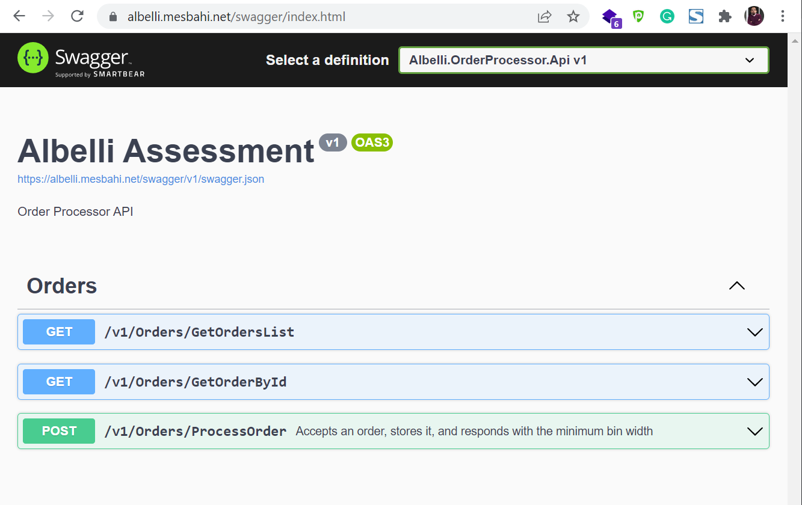
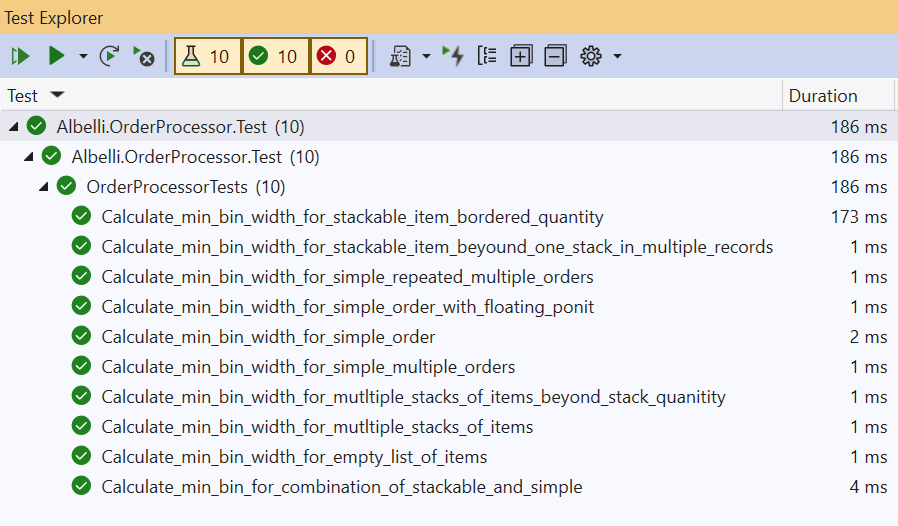

---
## [Live Demo (Swagger, API) ](https://albelli.mesbahi.net/swagger/index.html)
---
## About Implementation
> All requested features and specifications mentioned in assignment done.<br>Also, the live version deployed for testing the project easier.<br>The project was designed and developed according to the size of project.<br>**Based on project size and requirements, I tried to avoid unnecessary complexities in code to get maximum simplicity, readability, speed, and maintainability of the project.**
---


## **Backend API**
---
> I developed the backend REST using .NET 6, C# 10, XUnit<br> Also, unit tests were developed for testing the ```RequiredBinWidth``` calculation.<br>

```
dotnet ef migrations add "InitDatatbase" -o "Data/Migrations" -c "OrderProcessorDbContext" -p ./src/Albelli.OrderProcessor.Api/Albelli.OrderProcessor.Api.csproj


dotnet ef database update  -c "OrderProcessorDbContext" -p ./src/Albelli.OrderProcessor.Api/Albelli.OrderProcessor.Api.csproj

dotnet run --project .\src\Albelli.OrderProcessor.Api\Albelli.OrderProcessor.Api.csproj
```

## **Swagger**

<br>


## **Project structure**


## **Unit Tests Results**


## **Build and Unit Tests Results**


---
<br>

# .NET Software Engineer Technical Assignment

## Things we look for in this test

We expect the candidate to show us their skills in building testable and maintainable software with design and architecture in mind using industry best practices.
We value _simple_ more highly than _complex_, _working_ is better than _nice_. Readability matters.

## Business flow

A customer can order 1 or multiple items.  
For example, an order could consist of a photo book and 2 canvases.  
After the order is produced, it is delivered to one out of thousands of pickup points across the country.  
The package is put in a bin on a shelf at the pickup point. The bin has to be sufficiently wide for the package.  
Since bins are reserved upfront, we need to calculate the minimum bin width required for the order at the moment of order creation.  

## Assignment

Create a .NET Web API that accepts an order, stores it, and responds with the minimum bin width.  
We also should be able to get back all the information that is known about the order by its ID.  
Cover code with tests where you find it important.  

Order information submitted by customers:

* `OrderID`
* `ProductType` and `Quantity`. // _Product type can be 1 of type_ `photoBook`, `calendar`, `canvas`, `cards`, `mug`

Order information retrievable from the Web API by OrderID:
* `ProductType` with quantity
* `RequiredBinWidth` in millimeters (mm)

## Simplified width calculation rules

Items are put in the package next to each other (for simplicity of the test assignment).  
For example, 1 photo book (`0`), 2 calendars (`|`) and 1 mug (`.`) should look like this in the package:
`[0||.]`

But a mug has 1 detail: it can be stacked onto each other (up to 4 in a stack). So, an order with 1 photo book, 2 calendars, and 2 mugs should be positioned like this:
`[0||:]`

So the width of the 2 packages above is exactly the same. It would be still the same even if we add 2 more mugs (4 in total) but would increase if we add a 5th mug.

Package width occupied by 1 product unit per type:

* 1 `photoBook` consumes `19 mm` of package width
* 1 `calendar` — `10 mm` of package width
* 1 `canvas` — `16 mm`
* 1 set of greeting `cards` — `4.7 mm`
* 1 `mug` — `94 mm`

## Source Code

You should create a public GitHub and let us know when you've completed the exercise.

## Tools and libraries

You are free to use any additional third-party libraries and frameworks.

## Additional information

The authentication/authorization of the API is outside of scope.
Feel free to improve the application as **you** see fit (e.g. no logging but some tests are nice).  
If you have any questions please reach out to us.